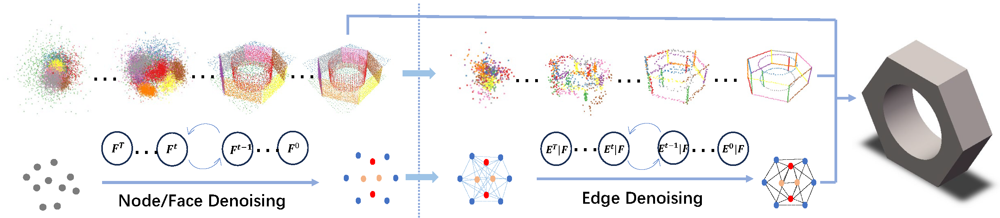

> We introduces BRep-GD, a novel graph diffusion model designed to address the challenges of topological validity and efficient generation in complex CAD Boundary Representation
modeling. By representing B-reps as graph structures and incorporating a continuous topology decoupled diffusion mechanism, BRep-GD achieves simultaneous generation of topological and geometric features, significantly improving the efficiency and quality of B-rep model generation.

We will release the code after the paper is accepted.


## Requirements

### Environment (Tested)
- Linux
- Python 3.11
- CUDA 11.8 
- PyTorch 2.5
- Diffusers 0.27


### Dependencies

Install PyTorch and other dependencies:
```
conda create --name brepgen_env python=3.9 -y
conda activate brepgen_env

pip install -r requirements.txt
pip install torch_geometric
pip install pyg_lib torch_scatter torch_sparse torch_cluster 
pip install chamferdist
```

If `chamferdist` fails to install here are a few options to try:

- If there is a CUDA version mismatch error, then try setting the `CUDA_HOME` environment variable to point to CUDA installation folder. The CUDA version of this folder must match with PyTorch's version i.e. 11.8.

- Try [building from source](https://github.com/krrish94/chamferdist?tab=readme-ov-file#building-from-source).

Install OCCWL following the instruction [here](https://github.com/AutodeskAILab/occwl).
If conda is stuck in "Solving environment..." there are two options to try:

- Try using `mamba` as suggested in occwl's README.

- Install pythonOCC: https://github.com/tpaviot/pythonocc-core?tab=readme-ov-file#install-with-conda and occwl manually: `pip install git+https://github.com/AutodeskAILab/occwl`.


## Training 
Train the surface and edge VAE (wandb for logging):

    sh train_vae.sh

Train the latent diffusion model (change path to previously trained VAEs):

    sh train_ldm.sh

```--cf``` classifier-free training for the CadNet40v2 and Furniture  dataset. 

```--data_aug``` randomly rotate the CAD model during training (optional).


## Generation and Evaluation
Randomly generate B-reps from Gaussian noise, both STEP and STL files will be saved:

    python sample.py --mode abc

This will load  the settings in ```eval_config.yaml```. Make sure to update model paths to the correct folder. 

Run this script for evaluation (change the path to generated data folder, with at least 3,000 samples):

    sh eval.sh
    