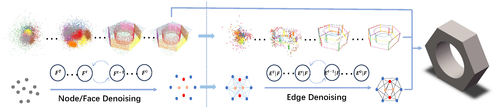

> We introduces BRep-GD, a novel graph diffusion model designed to address the challenges of topological validity and efficient generation in complex CAD Boundary Representation
modeling. By representing B-reps as graph structures and incorporating a continuous topology decoupled diffusion mechanism, BRep-GD achieves simultaneous generation of topological and geometric features, significantly improving the efficiency and quality of B-rep model generation.


## Requirements

### Environment (Tested)
- Linux
- Python 3.11
- CUDA 11.8 
- PyTorch 2.5
- Diffusers 0.27


### Dependencies

Install PyTorch and other dependencies:
```
conda create --name brepgen_env python=3.9 -y
conda activate brepgen_env

pip install -r requirements.txt
pip install torch_geometric
pip install pyg_lib torch_scatter torch_sparse torch_cluster 
pip install chamferdist
```

If `chamferdist` fails to install here are a few options to try:

- If there is a CUDA version mismatch error, then try setting the `CUDA_HOME` environment variable to point to CUDA installation folder. The CUDA version of this folder must match with PyTorch's version i.e. 11.8.

- Try [building from source](https://github.com/krrish94/chamferdist?tab=readme-ov-file#building-from-source).

Install OCCWL following the instruction [here](https://github.com/AutodeskAILab/occwl).
If conda is stuck in "Solving environment..." there are two options to try:

- Try using `mamba` as suggested in occwl's README.

- Install pythonOCC: https://github.com/tpaviot/pythonocc-core?tab=readme-ov-file#install-with-conda and occwl manually: `pip install git+https://github.com/AutodeskAILab/occwl`.


## Training 
Train the surface and edge VAE (wandb for logging):

    sh train_vae.sh

Train the latent diffusion model (change path to previously trained VAEs):

    bash scripts/train_ldm_*.sh

```--cf``` classifier-free training for the CadNet40v2 and Furniture  dataset. 

```--data_aug``` randomly rotate the CAD model during training (optional).


## Data Preprocessing
Data preprocessing and deduplication scripts are in `data_process/`:

- Main preprocessing entry: `data_process/process.sh`
- Main parser: `data_process/process_brep.py`
- Geometry conversion helpers: `data_process/convert_utils.py`
- Dedup entry: `data_process/deduplicate.sh`
- CAD-level dedup: `data_process/deduplicate_cad.py`
- Surface/edge-level dedup: `data_process/deduplicate_surfedge.py`

You can run preprocessing with:

    bash process.sh

You can run deduplication with:

    bash deduplicate.sh


## Data and Checkpoints
The processed dataset files and model checkpoints are available at:

- Dataset (PKLs): [link](https://drive.google.com/drive/folders/1v3geGkp38qvkt-gsT7t6JgaZfF0iZtC_?usp=sharing)
- LDM checkpoints: [link](https://drive.google.com/drive/folders/1qwFg3ntv3T56hiNcS3PmUCnPI70THnQZ?usp=drive_link)
- VAE checkpoints: [link](https://drive.google.com/drive/folders/1zBVQ97X4IoTu4gwnXcfvQYQj_CkenZqN?usp=sharing)

Our method can directly use the same data format as BRepGen. This means you can also train our model with data files that have already been preprocessed by BRepGen.

At the moment, there is no plan to release the raw STEP version of the CadNet40v2 dataset. We do plan to release the processed PKL files. If needed, STEP data can also be converted into PKL format with the provided scripts; please refer to the sampling and generation code for the conversion workflow.


## BRepGen Compatibility Note
Our data preprocessing and VAE training can be directly reused from BRepGen.

If preprocessing or VAE training in this repository has execution issues, please refer to and use the corresponding BRepGen preprocessing and VAE modules/scripts first.


## Generation
Randomly generate B-reps from Gaussian noise, both STEP and STL files will be saved:

    bash scripts/sample/sample_c_c.sh

    